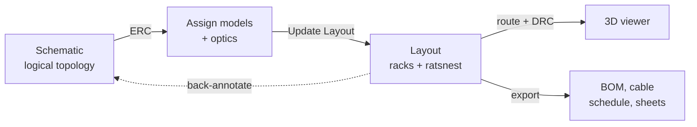
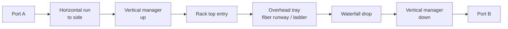

# Datacenter EDA — KiCad-style Design Spec

Sep 23, 2026 · @rigo

## Overview

Build a browser-based "EDA for datacenters" that follows KiCad's workflow: design the **logical network in a schematic**, push it to a **physical rack/floor layout** where unrouted connections appear as a ratsnest, route fiber neatly with pinnable waypoints, then inspect the result in a **3D viewer**.

| KiCad concept | Datacenter equivalent |
| --- | --- |
| Schematic editor (Eeschema) | Topology editor: devices as symbols, links as wires |
| Symbol | Device symbol (switch, server, panel) with port pins |
| Net / netlist | Link (port-to-port connection) / link list |
| Footprint | Physical device model: height in U, faceplate, port positions |
| Footprint assignment | Choosing a physical model + transceivers for each symbol |
| Update PCB from Schematic (F8) | Update Layout from Schematic |
| PCB editor (Pcbnew) | Layout editor: floor plan + rack elevations |
| Board outline | Room / cage outline |
| Ratsnest | Airwires between connected ports not yet routed |
| Tracks | Routed fiber / copper cables |
| Copper layers | Routing layers: overhead tray, underfloor, in-rack |
| Vias | Drops: tray-to-rack transitions |
| ERC / DRC | Topology checks / physical checks |
| 3D viewer | 3D room view of racks, devices, and cable runs |
| BOM + gerbers | BOM, cable schedule, rack elevation sheets |



The schematic is the source of truth for *what connects to what*; the layout is the source of truth for *where things are and how cables run*.

**Non-goals for v1:** power/thermal simulation, live device discovery, real-time multi-user editing, auto-router. Leave hooks in the model.

## Tech stack

A TypeScript SPA with three editors sharing one project store; no backend in v1.

| Layer | Choice | Why |
| --- | --- | --- |
| Language | TypeScript (strict) | The typed data model is the core of the app |
| Framework | React 18 + Vite | Fast dev loop, static deploy |
| 2D editors | Konva.js via react-konva | Hit-testing, drag, layers, zoom/pan for schematic and layout |
| 3D viewer | Three.js via @react-three/fiber + drei | Orbit controls, instancing for thousands of devices |
| State | Zustand + Immer, command stack | One store for all editors; undo/redo per editor |
| Geometry | Custom utils + rbush spatial index | Orthogonal snapping, segment hit-testing |
| Persistence | IndexedDB (idb-keyval) + JSON files | Offline, no server |
| UI chrome | Tailwind + Radix UI | Tabs, panels, dialogs |
| Testing | Vitest (model, ERC/DRC, sync), Playwright (editor flows) |  |
| IDs | nanoid | Stable IDs; sync between editors keys on them |

**Suggested layout**

```
src/
  model/        # types, factories, catalog, pure logic
    sync/       # schematic -> layout update, back-annotation
    erc/ drc/   # rule checks, pure functions
  store/        # zustand store, commands, undo/redo
  editors/
    schematic/  # konva schematic editor
    layout/     # konva floor + rack elevation editor
    viewer3d/   # three.js scene
  panels/       # library, inspector, link list, issues
  io/           # save/load, exports
  catalog/      # symbol + footprint + optic + cable JSON
```

Keep `/src/model` free of React, Konva, and Three imports.

## Data model

Mirror KiCad's split: a **logical** layer (components + links, owned by the schematic) and a **physical** layer (placements + routes, owned by the layout). Both reference the same `Component.id`, which is how Update Layout and back-annotation work.

```ts
type Id = string;
type Vec2 = { x: number; y: number };
type Vec3 = { x: number; y: number; z: number };  // mm; y is up in 3D

// ---------- Catalog ----------
type PortType = 'SFP' | 'SFP+' | 'SFP28' | 'QSFP+' | 'QSFP28' | 'QSFP56' | 'QSFP-DD' | 'OSFP' | 'RJ45' | 'LC' | 'MPO-12';

interface SymbolDef {            // schematic look
  id: string; kind: 'switch' | 'server' | 'patch-panel' | 'router' | 'firewall' | 'generic';
  width: number; height: number; // schematic units
  pins: { portId: string; side: 'L' | 'R' | 'T' | 'B'; offset: number }[];
  defaultFootprintIds: string[]; // physical models compatible with this symbol
}

interface FootprintDef {         // physical device
  id: string; model: string; vendor?: string;
  heightU: number; depthMm: number;
  ports: { id: string; type: PortType; speedsGbps: number[]; pos: Vec2; face: 'front' | 'rear' }[];
  model3d?: string;              // optional GLB path; else extruded box with faceplate texture
}

interface TransceiverDef { id: string; formFactor: PortType; speedGbps: number; media: 'MMF' | 'SMF' | 'DAC' | 'AOC' | 'Copper'; connector: string; reachM: number; lanes: number }
interface CableDef { id: string; media: string; endA: string; endB: string; color: string; bendRadiusMm: number; breakout?: { fanout: number } }

// ---------- Logical (schematic) ----------
interface Component {
  id: Id;
  ref: string;                   // reference designator, e.g. 'SW1', 'SRV12' (auto-annotated)
  symbolDefId: string;
  footprintDefId: string | null; // assigned physical model
  value?: string;                // role label, e.g. 'leaf-a'
  optics: Record<string, string>;// portId -> TransceiverDef.id
  sch: { pos: Vec2; rotation: 0 | 90 | 180 | 270; sheetId: Id };
}

interface Link {                 // the "net": always exactly two endpoints (plus breakout lanes)
  id: Id;
  a: { componentId: Id; portId: string; lane?: number };
  b: { componentId: Id; portId: string; lane?: number };
  cableDefId: string | null;
  label?: string;
  sch: { wirePoints: Vec2[] };   // schematic wire geometry only
}

interface Sheet { id: Id; name: string; parentId: Id | null } // hierarchical sheets: 'Pod A', 'Spine'

// ---------- Physical (layout) ----------
interface Room { outline: Vec2[]; gridMm: number; ceilingMm: number; raisedFloorMm: number }

interface Rack { id: Id; name: string; pos: Vec2; rotationDeg: 0 | 90 | 180 | 270; heightU: number; widthMm: number; depthMm: number }

interface Placement {            // a component placed in a rack
  componentId: Id;
  rackId: Id | null;             // null = unplaced (shows in 'unplaced' bin)
  uPosition: number | null;
  face: 'front' | 'rear';        // which rack face the device's front points to
}

type RoutingLayer = 'overhead' | 'underfloor' | 'in-rack';

interface Tray { id: Id; layer: RoutingLayer; points: Vec2[]; widthMm: number; heightMm: number }

interface Route {
  linkId: Id;
  segments: { layer: RoutingLayer; points: Waypoint[] }[]; // layer change = a drop (via)
}

interface Waypoint { id: Id; pos: Vec2; pinned: boolean; anchor?: { rackId: Id; offset: Vec2 } }

// ---------- Project ----------
interface Project {
  id: Id; name: string; version: 1;
  sheets: Sheet[]; components: Component[]; links: Link[];
  room: Room; racks: Rack[]; placements: Placement[]; trays: Tray[]; routes: Record<Id, Route>;
  customCatalog: { symbols: SymbolDef[]; footprints: FootprintDef[] };
}
```

**Invariants**

- Components and links are created and deleted only in the schematic. The layout cannot add a connection (it can only propose one via back-annotation, see below).
- One device per rack U range; one optic per port; one link per port lane.
- A link with no `Route` renders as an airwire in the layout. A link whose endpoint component is unplaced has no airwire.
- Every mutation is a command with `do`/`undo`.

## Component library

Ship a starter catalog as JSON in `/src/catalog`, using generic names (no vendor trademarks in v1). Each device below ships as a paired symbol (schematic) and footprint (physical model); the library panel in each editor lists them by category, with search.

**Racks**

| Item | Size | Notes |
| --- | --- | --- |
| Standard rack | 42U, 600 mm wide, 1070 mm deep | Default |
| Tall rack | 48U, 600 mm wide |  |
| Network rack | 42U, 800 mm wide | Extra width for cable management |

**Devices**

| Item | Height | Ports |
| --- | --- | --- |
| ToR / leaf switch | 1U | 48× SFP28 (25G) + 8× QSFP28 (100G) |
| Spine switch | 2U | 32× QSFP-DD (400G) |
| Management switch | 1U | 48× RJ45 (1G) + 4× SFP+ (10G) |
| 1U server | 1U | 2× SFP28 + 1× RJ45 (BMC) |
| 2U server | 2U | 2× QSFP28 + 2× SFP28 + 1× RJ45 (BMC) |
| GPU server | 4U | 8× OSFP (400G) + 2× QSFP28 + 1× RJ45 |
| Fiber patch panel | 1U | 24× LC duplex (front/rear) |
| MPO patch panel | 1U | 12× MPO-12 |
| Blank panel | 1U | none |

**Transceivers**

| Item | Form factor | Speed | Media / connector |
| --- | --- | --- | --- |
| 10G-SR | SFP+ | 10G | MMF / LC |
| 10G-LR | SFP+ | 10G | SMF / LC |
| 25G-SR | SFP28 | 25G | MMF / LC |
| 25G-LR | SFP28 | 25G | SMF / LC |
| 100G-SR4 | QSFP28 | 100G | MMF / MPO-12 |
| 100G-LR4 | QSFP28 | 100G | SMF / LC |
| 400G-DR4 | QSFP-DD | 400G | SMF / MPO-12 |
| 400G-SR8 | QSFP-DD | 400G | MMF / MPO-16 |
| 1G-T | SFP | 1G | Copper / RJ45 |

DAC and AOC are modeled as cables with integrated ends: placing one fills both cages with a virtual transceiver.

**Cables**

| Item | Default color | Ends |
| --- | --- | --- |
| OM4 duplex | Aqua | LC–LC |
| OS2 duplex | Yellow | LC–LC |
| OM4 MPO trunk | Aqua | MPO-12–MPO-12 |
| OS2 MPO trunk | Yellow | MPO-12–MPO-12 |
| MPO breakout | Aqua | MPO-12 → 4× LC |
| DAC 25G / 100G / 400G | Black | Integrated |
| AOC 100G / 400G | Orange | Integrated |
| Cat6A patch | Blue | RJ45–RJ45 |

Users can add custom devices via a simple form (name, height, port list) saved into a per-project custom catalog.

## Schematic editor

The schematic is where users design the network logically, with no concern for racks or distance. It should feel like Eeschema: place symbols, draw wires between pins, annotate, run ERC.

**Symbols**

- Each device is a rectangle with its ref (`SW1`), role (`leaf-a`), and model; ports are pins on its edges labeled by port id and type (`eth1/49 QSFP28`).
- Switches with many ports collapse unused pins into a "+40 unused" stub that expands on click, so a 56-port switch stays readable.
- Symbols support **port groups**: e.g. `uplinks` (8× QSFP28) and `downlinks` (48× SFP28) as separate pin banks.

**Wires (links)**

- Click a pin, click another pin: creates a `Link`. Wires draw orthogonally with auto-elbows; the user can drag wire segments.
- A wire carries a cable type (defaults from optics) and optional label; the label shows mid-wire.
- **Net labels / bus shortcuts:** for dense fabrics, allow a "fabric connector" tool: select N leafs and M spines, choose uplink port ranges, and the tool generates the full-mesh links (each leaf to each spine) with deterministic port assignment. This is the killer feature for leaf-spine design.
- **Breakouts:** a breakout wire from one QSFP pin fans out to 4 lanes, each linking to a different SFP pin.

**Hierarchical sheets**

- Sheets like "Spine", "Pod A", "Pod B", "OOB management". A sheet symbol on the root sheet exposes hierarchical pins; links can cross sheets.
- A **Duplicate sheet** command clones a pod with fresh refs, so users can design one pod and stamp out six.

**Annotation and assignment**

- Annotate (auto-number refs by kind: `SW`, `SRV`, `PP`) on demand or automatically on placement.
- A **model assignment table** (like KiCad's footprint assignment tool) lists every component with dropdowns for physical model and per-port optics; supports bulk assignment by filter ("all SRV\* → 1U server, 25G-SR on eth0/eth1").

**Interactions**

| Action | Key / gesture |
| --- | --- |
| Add symbol | A (opens library search) |
| Draw wire | W, or click-drag from a pin |
| Label | L |
| Rotate / mirror | R / X |
| Move / drag (keeps wires) | M / G |
| Fabric connector tool | Ctrl/Cmd+Shift+F |
| Run ERC | Toolbar button or Ctrl/Cmd+E |
| Update Layout | F8 |

## Update Layout from Schematic

Pressing F8 diffs the logical model against the physical model and shows a change list before applying, exactly like KiCad's Update PCB dialog.

| Change detected | Layout action |
| --- | --- |
| New component | Create an unplaced `Placement`; device appears in the "Unplaced" bin beside the floor |
| Component deleted | Remove placement; orphaned routes are deleted (listed in the dialog) |
| Model (footprint) changed | Keep rack + U if the new height fits; otherwise unplace it and warn |
| New link | Airwire appears (if both ends placed) |
| Link deleted | Remove route; its pinned waypoints go with it |
| Link endpoint changed | Keep route waypoints, re-attach the end; flag route for review |
| Ref renamed | Update labels only |

- The dialog has checkboxes per change and an **Apply** button; applying is one undoable command.
- Matching is by `Component.id`, never by ref, so re-annotation does not break placements.
- **Back-annotation (Layout → Schematic):** swapping which port a cable lands on in the layout (e.g. to shorten a run) creates a proposed schematic change the user accepts, like KiCad's pin swap back-annotation. Ref and model changes made in the layout inspector also flow back.
- A status badge on the Layout tab shows "Out of sync" whenever the schematic has unapplied changes.

## Layout editor

The layout is the Pcbnew equivalent: place racks on a floor, drop devices into U slots, and route every airwire into a real cable path. It has two linked 2D views, switchable with a tab or shown split.

**Views**

- **Floor plan (top-down):** room outline, racks as rectangles with front-face arrows, trays, and cable runs. This is where inter-rack routing happens.
- **Rack elevation (front/rear):** selected racks side by side with U rails and faceplates. This is where devices are placed and in-rack patching is dressed.
- Selecting something in one view highlights it in the other and in the 3D viewer (cross-probing, like KiCad).

**Placement**

- Unplaced components sit in a bin panel. Drag one onto a rack elevation; a ghost shows the target U range, green if free, red if blocked.
- **Place by rule:** "Put SW\* with role leaf at U42 of each rack in row A" or "fill SRV\* bottom-up in R01–R06", similar to KiCad's footprint placement helpers.
- Racks snap to the floor grid (default 600 mm tiles) and can be arrayed into rows with a spacing parameter.

**Ratsnest**

- Every link without a route is an airwire: a thin straight line between the two port positions, in the cable's color at 60% opacity. In floor view it runs rack-center to rack-center; in elevation view port to port.
- Airwires update live while racks and devices are dragged.
- Toolbar toggles: show all airwires, only for selection, or hide. Status bar shows `Unrouted: N / M`.
- Like KiCad, the ratsnest shows the *shortest* candidate when a link can land on interchangeable ports (e.g. any free port in a patch panel), helping the user place for short runs.

**Routing layers and drops**

- Three routing layers: **overhead** (trays above racks), **underfloor**, **in-rack** (vertical cable managers). Each renders in its own color; inactive layers dim, like copper layers.
- A route is a chain of segments per layer. Changing layer mid-route inserts a **drop** (the via equivalent) where the cable exits a tray into a rack's top or bottom.
- Drops snap to defined rack entry points (top-left, top-right, bottom brush panel).

**Routing a cable**

- Double-click an airwire or select a link and press X (KiCad's route key). The path starts at port A and follows the cursor.
- Clicks drop waypoints. Orthogonal by default; Shift allows 45°; / toggles free-angle. Waypoints snap to the grid, tray centerlines, and existing cables to form bundles.
- V switches layer and places a drop. Finish on the destination port or Enter; Esc cancels.

**Editing and pinning**

- Drag a waypoint; drag a segment midpoint to add one; double-click to delete. Dragging an orthogonal segment moves it perpendicular and adjusts neighbors (like trace dragging).
- Each waypoint has `pinned`. Pinned = filled square; unpinned = hollow circle. P toggles; context menu offers Pin all / Unpin all / Unroute / Straighten / Change cable.
- Waypoints are **pinned by default** when a route is finished (configurable).
- When a rack, device, or port moves: **pinned waypoints never move**. Unpinned waypoints adjacent to the moved endpoint are recomputed so the end segment stays orthogonal to the port.
- Waypoints dropped inside a rack's cable manager are **anchored** to that rack and move with it by offset, so in-rack dressing survives moving the rack.
- Cables sharing a tray render offset side by side, with tray fill % shown on hover.

**Cable length**

- Routed length = 2D path length + vertical rise/fall at each drop (from rack height, tray height, raised floor depth) + 10% slack + 0.5 m per end, rounded up to standard lengths (1, 2, 3, 5, 7, 10, 15, 20, 30 m).
- Unrouted length = Manhattan distance + vertical estimate, marked "est.".

**Performance target:** 60 fps pan/zoom with 50 racks, 1,000 devices, 5,000 links. Cache static layers as bitmaps; only cables and overlays redraw during drags; rbush for hit-testing.

## Cable pathways (the trace equivalent)

In a PCB you route traces; here you route cables through **pathways**. Every routed cable follows the same physical path real techs build: port → across to the rack's vertical cable manager → up the manager → out the rack top → into an overhead tray → along the tray → down a waterfall into the far rack → down its manager → across to the port.



The user routes the **tray segment** by hand in the floor plan (with pinned waypoints); the in-rack segments are auto-dressed by rule and can be overridden with pins.

**Pathway components (added to the catalog)**

| Item | Where | Key parameters |
| --- | --- | --- |
| Fiber runway | Overhead, above racks | Width 4/6/12 in, elevation above floor, yellow, optional cover |
| Ladder rack | Overhead, above racks | Width 12/18/24 in, elevation, for copper bundles |
| Wire basket tray | Overhead or underfloor | Width, depth, elevation |
| Tray fittings | Tray joints | Elbow 90°, tee, cross, reducer, waterfall (drop into rack) |
| Vertical cable manager | Beside each rack, left and/or right | Width 6/10/12 in, finger spacing = 1U, front/rear |
| Horizontal cable manager | In rack, 1U/2U | Finger or D-ring, front/rear |
| Fiber enclosure | Top of rack, 1–4U | Cassette slots, LC/MPO adapters |
| Rack top entry | Rack roof | Brush or open cutout, left/center/right |

**Data model additions**

```ts
interface Tray {
  id: Id;
  kind: 'fiber-runway' | 'ladder' | 'basket';
  layer: RoutingLayer;
  points: Vec2[];            // centerline in floor plan
  widthMm: number; depthMm: number;
  elevationMm: number;       // bottom of tray above finished floor
  fittings: { at: Vec2; type: 'elbow' | 'tee' | 'cross' | 'waterfall'; rackId?: Id }[];
}

interface RackAccessory {
  id: Id; rackId: Id;
  type: 'vcm' | 'hcm' | 'fiber-enclosure' | 'top-entry';
  side?: 'left' | 'right';   // for vcm and top-entry
  face?: 'front' | 'rear';
  uPosition?: number; heightU?: number; widthMm?: number;
}

interface InRackPath {       // auto-generated, overridable
  side: 'left' | 'right';    // which vertical manager the cable uses
  entry: Id;                 // top-entry accessory
  pinned: boolean;           // true once the user overrides the auto choice
}

// Route gains explicit in-rack ends:
interface Route {
  linkId: Id;
  aRack: InRackPath; bRack: InRackPath;
  trayPath: { trayId: Id; waypoints: Waypoint[] }[];  // hand-routed, pinnable
}
```

**Auto-dressing rules (in-rack)**

- From the port, run horizontally toward the nearer vertical manager (left for the left half of the faceplate, right for the right half), unless the user pins a side.
- Enter the manager at the port's U, travel vertically to the top entry, exit up to the tray elevation.
- Cables from the same device and side merge into one **bundle** in the manager; bundles get a velcro tie every 300 mm (render detail only).
- Fan out from the bundle to each port over the last \~150 mm, so ports look like the photo: a combed bundle splitting into individual patch cords.
- Copper and fiber use separate managers or opposite sides when both exist (configurable).

**Tray routing rules**

- A cable leaves the rack only at a waterfall fitting over that rack; if none exists, the router offers to add one.
- Fiber must ride fiber runway; copper rides ladder or basket. Tray segments between waypoints snap to the tray centerline, and cables in the same tray render packed side by side, then stacked.
- Optional service loop (coil of slack) placed at a pinned waypoint in the tray.

**DRC additions**

- Fiber routed in a copper tray or copper in fiber runway (Error).
- No vertical manager on the side a cable needs (Warning), and manager fill > 60% (Warning).
- Tray fill > 50% of cross-section (Warning); waterfall missing where a cable drops (Error).
- Tray elevation clashes with rack height + top entry clearance (< 150 mm) (Error).

**Length** now comes from the full 3D path: in-rack horizontal + manager vertical + rise to tray + tray run + drop + far in-rack, plus slack, rounded to standard lengths.

## 3D viewer

The 3D viewer is read-only in v1, like KiCad's: it renders the layout so users can sanity-check heights, tray clearance, and cable runs. Open it with Alt+3 or a toolbar button; it opens in a split pane or its own tab and updates live.

**Scene contents**

- Room floor from the outline (raised-floor tiles optional), ceiling as a faint plane, threaded-rod supports hanging trays from the ceiling.
- **Overhead pathways:** fiber runway as a yellow U-channel, ladder rack as two side rails with rungs every 300 mm, basket tray as wire mesh; fittings (elbows, tees, waterfalls) at their positions and elevations.
- Racks as frames with posts, roof with top-entry cutouts, and optional doors (toggle).
- **Rack accessories:** vertical cable managers as tall channels beside the rack with fingers at every U; horizontal managers; fiber enclosures at the top with cassettes.
- Devices as boxes of true height/depth at their U; front face uses a generated faceplate texture from the footprint's port positions (GLB from `model3d` when provided). Transceivers protrude from cages; empty cages are dark.
- **Cables follow the full pathway:** laid in the tray, curving over the waterfall, dropping through the top entry, running down inside the vertical manager, then passing through the fingers at the port's U and fanning out horizontally into each port — the look in a well-dressed rack.
- Cable geometry: `TubeGeometry` along a Catmull-Rom curve through the full 3D path; corners respect `CableDef.bendRadiusMm`; bundled runs render as one packed group with velcro rings every 300 mm and split into individual cords near the ports. Colors by type: yellow OS2, aqua OM4, blue/white Cat6A, black DAC.
- Unrouted links optional as thin straight airwires.

**Controls**

| Action | Input |
| --- | --- |
| Orbit / pan / zoom | Left drag / right drag / wheel |
| Preset views | Top, front, rear, iso buttons |
| Walk mode | W/A/S/D at eye height (1.7 m) for an aisle view |
| Toggle layers | Doors, overhead trays, underfloor, cables, airwires |
| Cross-probe | Click a device or cable to select it in the 2D editors |
| Screenshot | Export PNG of the current view |

**Performance:** use `InstancedMesh` for racks, devices, and optics of the same model; merge cable tubes per layer; target 60 fps at the same scale as the layout editor, with tube resolution reduced at a distance.

## ERC and DRC

Split checks the KiCad way: **ERC** validates the logical design in the schematic; **DRC** validates the physical build in the layout. Both run on demand and live (debounced), list issues in a drawer, and zoom to the item on click. Each rule is a pure function `(project) => Issue[]` with unit tests, and severities are configurable per project.

**ERC (schematic)**

| Rule | Default | Check |
| --- | --- | --- |
| Port reuse | Error | A port or lane is on more than one link |
| Form-factor mismatch | Error | Assigned optic doesn't fit the port (QSFP28 in SFP28); allow SFP→SFP28 and QSFP28→QSFP-DD |
| Speed mismatch | Error | Link ends run at different speeds (breakout lanes excepted) |
| Media mismatch | Error | MMF optic to SMF optic, or cable media doesn't match optics |
| Connector mismatch | Error | LC cable on MPO optic without a breakout |
| Missing optic | Warning | Optical port on a link has no optic assigned (DAC/AOC excepted) |
| Unassigned model | Warning | Component has no physical model |
| Single-homed server | Warning | Server has only one uplink when its role expects two (rule-driven) |
| Unconnected uplinks | Info | Switch uplink group has free ports |

**DRC (layout)**

| Rule | Default | Check |
| --- | --- | --- |
| U collision / overflow | Error | Devices overlap or exceed rack height |
| Unplaced components | Error | Component in schematic has no placement |
| Unrouted links | Warning | Airwires remain |
| Reach exceeded | Error | Routed length exceeds optic reach |
| Tray overfill | Warning | Tray fill > 50% of cross-section (configurable) |
| Bend radius | Warning | A route corner is tighter than the cable's minimum bend radius |
| Clearance | Warning | Rack placed in a hot/cold aisle keep-out or too close to a wall (user-drawn keep-out zones) |
| Wrong face | Warning | Cable routed to a port on the rack face opposite its tray drop |
| Out of sync | Error | Layout doesn't match schematic (unapplied F8 changes) |

## Persistence and export

- Autosave to IndexedDB (debounced 1 s); project picker for saved projects; JSON open/save with `version` for migrations.
- **Link list (netlist) export:** CSV/JSON of every link, the datacenter equivalent of a netlist.
- **Cable schedule (CSV):** label, A rack/U/ref/port/optic, B rack/U/ref/port/optic, cable type, routed length (m), layer path.
- **BOM (CSV):** racks, devices by model, optics by type, cables by type and standard length, tray length.
- **Rack elevation sheets (PDF/SVG):** one page per rack, front and rear, with a title block (project, rev, date) like a KiCad plot.
- **Schematic plot (PDF/SVG)** per sheet; **3D screenshot (PNG)**.
- **Cable labels (CSV)** formatted for label printers: both ends per cable.

## Build milestones

Each milestone is usable and tested before the next.

1. **Shell:** Vite + React, tabbed Schematic / Layout / 3D, shared Zustand store with command stack, IndexedDB autosave.
2. **Schematic basics:** symbol library, place/move/rotate, wires between pins, labels, annotation, inspector.
3. **Schematic power tools:** hierarchical sheets, duplicate sheet, fabric connector tool, breakouts, model assignment table, ERC.
4. **Layout placement:** room outline, racks, rack arrays, floor + elevation views, Update Layout from Schematic dialog, drag devices into U slots, place-by-rule.
5. **Ratsnest:** live airwires in both views, toggles, unrouted counter, cross-probing.
6. **Routing:** layers, trays, drops, route tool, waypoint editing, pin/unpin, rack anchoring, move behavior, lengths.
7. **DRC + back-annotation.**
8. **3D viewer:** scene generation, instancing, cable tubes, controls, cross-probe.
9. **Exports** and a performance pass against the targets.

## Acceptance criteria

- [ ] Using the fabric connector, a user creates 2 spines × 8 leafs full mesh in the schematic in under 2 minutes, with ERC clean.
- [ ] Duplicating a pod sheet produces new refs and links with no ERC errors.
- [ ] F8 shows an accurate change list; applying it puts all new components in the Unplaced bin and draws airwires once placed.
- [ ] Deleting a link in the schematic and pressing F8 removes its route and airwire in the layout.
- [ ] A routed cable with pinned waypoints keeps them exactly in place when an endpoint device moves to another U or rack; unpinned end waypoints re-square.
- [ ] Moving a rack moves its anchored in-rack waypoints with it.
- [ ] Clicking a cable in 3D selects it in the layout and highlights its link in the schematic.
- [ ] DRC flags a 100G-SR4 link routed longer than its rated reach.
- [ ] Undo/redo covers every action in all editors; reload restores the project exactly.
- [ ] 50 racks, 1,000 devices, 5,000 links: 60 fps in layout and 3D on a mid-range laptop.

## Open questions

- Should the schematic also model power (PDU feeds as nets), or network only for v1?
- Accounts and cloud save in v1, or local-only for now?
- Should the 3D viewer allow placement edits later, or stay view-only like KiCad's?
- Any specific vendor models from your site's standard builds to seed the catalog?
